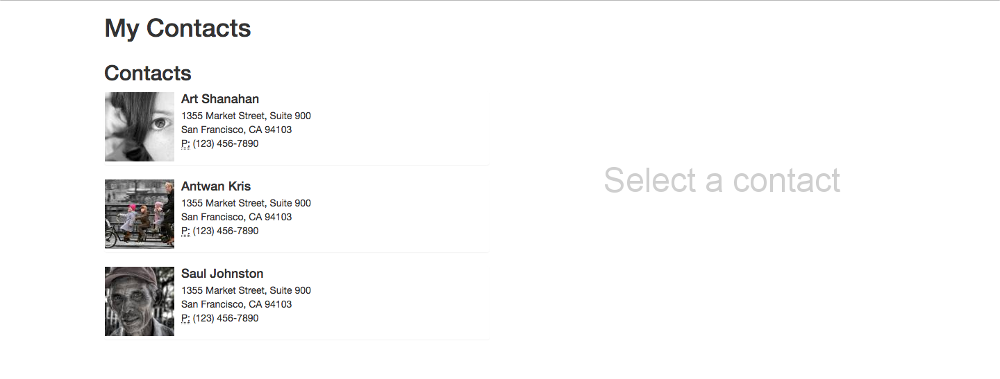
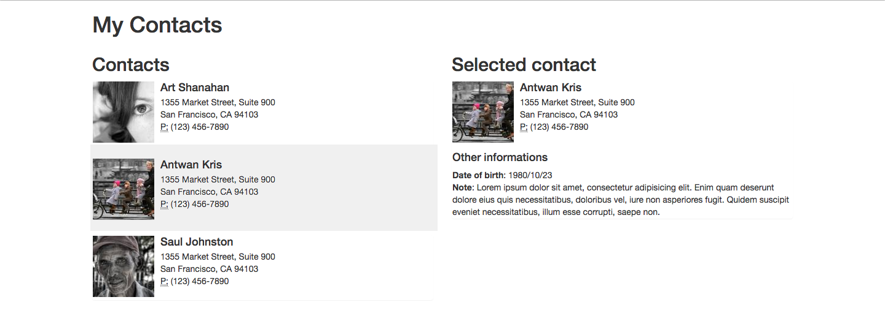

# NuageNetworks

## Exercise #3

Create a contacts app like in the following screens:

- 

- 

Even though you may use any library/framework you prefer, ReactJS will be considered a big plus.

### Server

To start the server, run from the root folder:

```
npm install
npm run exercise3
```

You can then fetch all the contacts from http://localhost:8080/contacts
